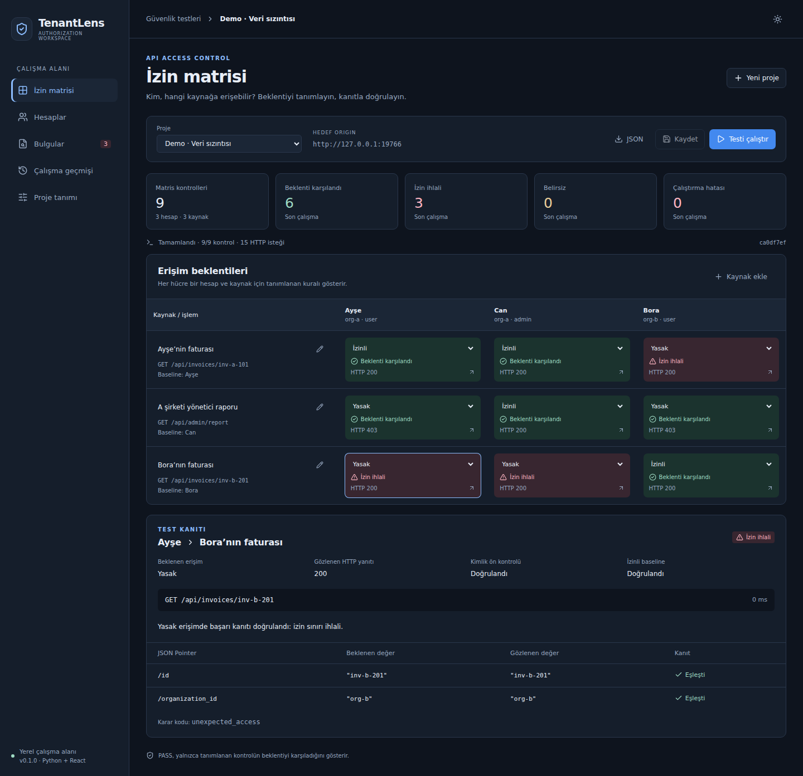

# TenantLens

[](https://github.com/Muhammet0-1/TenantLens/actions/workflows/ci.yml)

**Yerel web paneliyle, kanıta dayalı API yetkilendirme testleri.**

TenantLens; kullanıcı, rol ve şirket hesaplarının gerçek API yanıtlarını
tanımladığın erişim politikasıyla karşılaştırır. İzin matrisindeki her hücreyi
değerlendirmeden önce hesap kimliğini ve kaynağa erişmesine izin verilen bir
hesabın referans yanıtını (baseline) doğrular. Tek başına `200 OK` yanıtı,
yasaklı bir hesabın beklenen kaynağa eriştiğini kanıtlamaz.

[Kullanım rehberi](KULLANIM.md) · [Mimari](docs/architecture.md) ·
[Güvenlik sınırları](SECURITY.md) · [Test sonuçları](docs/validation.md)



## İlk çalıştırma

**Python 3.11+** ve güncel bir tarayıcı gerekir. Derlenmiş React paneli depoda
hazırdır. Çalıştırmak için **pip install, npm install veya paket indirmen gerekmez**.

Depoyu klonla veya dağıtım ZIP'ini aç. Ardından proje klasöründe çalıştır:

```fish
git clone https://github.com/Muhammet0-1/TenantLens.git
cd TenantLens
python3 -m tenantlens serve --demo
```

Tarayıcıda **http://127.0.0.1:8765** adresini aç. Bir demo projesi seç ve
**Testi çalıştır** düğmesine bas. Sunucuyu `Ctrl+C` ile durdurabilirsin.
Windows'ta `python3` yerine `py -3` kullan.

| Yerel demo | Beklenti karşılandı (PASS) | İhlal (VIOLATION) | Belirsiz (INCONCLUSIVE) | Hata (ERROR) | HTTP isteği |
| --- | ---: | ---: | ---: | ---: | ---: |
| Veri sızıntısı / hatalı yetkilendirme | 6 | 3 | 0 | 0 | 15 |
| Düzeltilmiş yetkilendirme | 9 | 0 | 0 | 0 | 15 |
| Bora'nın geçersiz oturumu | 4 | 0 | 5 | 0 | 9 |

Demolar, 8766–8768 portlarında çalışan üç gerçek yerel API sunucusunu kullanır.
`--demo` tarafından sağlanan kimlik bilgileri herkese açık örnek değerlerdir.
Sonuçları, kendi projelerinde de kullanılan aynı test motoru üretir.

## Panelin özellikleri

- Açık İzinli / Yasak kurallarıyla düzenlenebilir hesap × kaynak izin matrisi.
- JSON Pointer ile hesap kimliği ve kaynak referans yanıtı doğrulaması.
- Her hücrede tekil kanıt değerleri, karar gerekçesi ve gözlenen HTTP durumu.
- Proje oluşturma, doğrulanan JSON içe/dışa aktarımı ve hesap/kaynak düzenleme.
- Arka planda test, ilerleme takibi ve iptal; çalışma alanı başına tek etkin test.
- SQLite ile kalıcı kayıt ve tamamlanan testlerin değiştirilemez anlık görüntüleri.
- HTML karakterleri güvenli biçimde kaçışlanan bağımsız raporlar ve yapılandırılmış JSON raporları.
- Koyu/açık tema ve farklı ekran boyutlarına uyumlu Türkçe arayüz.
- Panelle aynı test motorunu, demo senaryolarını ve rapor üreticisini kullanan CLI.

## Sonuçlar ne anlama geliyor?

| Sonuç | Anlamı |
| --- | --- |
| `PASS` — Beklenti karşılandı | Tanımlanan erişim beklentisi, gerekli doğrulamalarla karşılandı. |
| `VIOLATION` — İzin ihlali | Yasak erişim kaynak kanıtını sağladı veya beklenen izinli erişim açıkça reddedildi. |
| `INCONCLUSIVE` — Belirsiz | Kimlik, referans yanıt, oturum veya kanıt; erişim sonucunu belirlemeye yetmedi. |
| `ERROR` — Çalıştırma hatası | İstek başarısız oldu, zaman aşımına uğradı, yanıt boyutu sınırını aştı veya sunucu hatası aldı. |

İzinli olması beklenen bir isteğin tanımlanan ret koşulunu sağlaması bir
**politika uyuşmazlığıdır**; tek başına sömürülebilir bir güvenlik açığı
göstermez. Kararın gerekçe kodunu incele. `PASS`, yalnızca tanımlanan kontrolün
test anındaki sonucunu ifade eder.

## Kendi API'ni bağlama

1. `examples/custom-project.json` dosyasını kopyala veya panelden proje oluştur.
2. Hedef adresini protokol, alan adı ve portuyla tanımla; hesap kimliklerini ve kaynak kanıtı koşullarını belirle.
3. Her kaynağa erişmesine izin verilen bir referans hesabı (baseline) ata ve tüm izinleri tanımla.
4. Bearer tokenlarını, her hesabın `auth_env` adıyla sunucu sürecinin ortam değişkenlerine ekle.
5. Paneli `--demo` olmadan başlat, JSON'u içe aktar ve testi çalıştır.

Örnek projeye uygun **fish** komutları:

```fish
read --silent --prompt-str 'A kullanıcısının tokenı: ' token_a
set -gx TENANTLENS_USER_A_TOKEN $token_a
set -e token_a
read --silent --prompt-str 'B kullanıcısının tokenı: ' token_b
set -gx TENANTLENS_USER_B_TOKEN $token_b
set -e token_b
python3 -m tenantlens serve
```

Tokenlar test başlarken okunur. Ortam değişkenlerini başka bir terminalde
değiştirirsen sunucuyu yeni değerlerle yeniden başlat. Arayüz, ortam değişkeni
referansını ve mevcut olup olmadığını gösterir; token değerinin girildiği bir
alan veya token değerini sunan bir API bulunmaz.

Bash kullanıyorsan aynı değişken adları için `read -r -s` ve ardından `export`
kullanabilirsin. v0.1'de yalnızca Bearer kimlik doğrulaması desteklenir. Özel
başlıklar, çerezler, OAuth token yenileme ve multipart/gövde içeren istekler bu
sürümün kapsamı dışındadır.

## Terminal kullanımı

```fish
python3 -m tenantlens check --demo fixed --output reports
python3 -m tenantlens check --demo vulnerable --format json --output reports
python3 -m tenantlens check examples/custom-project.json --output reports
```

Çıkış kodları: `0` beklentiler karşılandı; `1` politika ihlali var; `2`
belirsiz kontrol, istek hatası veya başlatma/yapılandırma hatası var.
CLI demoları geçici portlarda çalışır ve test sonunda kapanır.

## Kapsam ve sınırlar

v0.1; **tanımlanan tek bir hedefe GET isteklerini, Bearer kimlik doğrulamasını,
JSON'daki tekil değerler için eşitlik koşullarını ve sıralı çalıştırmayı** destekler.
Sınırlar: 12 hesap, 50 kaynak, 300 matris kontrolü, saniyede 1–50 istek,
0,1–30 saniye soket zaman aşımı ve 1 KiB–1 MiB yanıt gövdesi.
Varsayılanlar; saniyede 12 istek, demolarda 3 saniye (özel projede belirtilmezse
5 saniye) zaman aşımı ve 256 KiB yanıt boyutudur.

İstekler yeni bağlantılar kullanır ve HTTPS sertifikalarını doğrular.
Ortam değişkenlerindeki proxy ayarları kullanılmaz; hesaplar çerez paylaşmaz,
istekler yeniden denenmez ve yönlendirmeler takip edilmez.
Panel yalnızca `127.0.0.1` adresinde dinler; Host, Origin ve CSRF kontrolleri
uygular. Kişisel bilgisayarda kullanılmak üzere tasarlanmıştır. Uzaktan
barındırma veya ortak bir üretim hizmeti olarak çalıştırma ayrı bir tasarım
gerektirir. Kesin sınırlar ve veri saklama davranışı için
[Güvenlik sınırları](SECURITY.md) belgesine bak.

## Testler ve geliştirme

Python testleri yalnızca standart kütüphaneyi kullanır:

```fish
python3 -S -m unittest discover -s tests -v
```

Paneli yeniden derlemek için Node 22.12+ veya Node 24 kur, ardından:

```fish
cd web
npm ci
npm run build
npx playwright install chromium
npm run test:browser
```

Paket indirme ve ağ erişimi yalnızca bu isteğe bağlı geliştirme adımları için
gerekir. Depodaki `tenantlens/static` derlemesi uygulamanın çevrimdışı
başlatılmasını sağlar. Tarayıcı testi kendi geçici panelini ve gerçek yerel
API hedeflerini başlatır; düzenleme, dışa aktarma, geçmiş ve iptal işlemlerini
sınar ve demo ekran görüntüleri oluşturur.

GitHub Actions yapılandırması; Python 3.11–3.13 testlerini, panel derlemesini
ve tarayıcı kontrollerini içerir.
[Katkı rehberi](CONTRIBUTING.md) belgesinde geliştirme bilgileri bulunur.

## Otomatik testler — GitHub Actions

[Checks iş akışı](https://github.com/Muhammet0-1/TenantLens/actions/workflows/ci.yml),
Python 3.11, 3.12 ve 3.13 sürümlerinin her birinde **66 Python testini** çalıştırır.
Ayrı bir işte paneli derler ve Chromium ile **23 tarayıcı kontrolü** gerçekleştirir.
Sayfanın başındaki rozet gerçek GitHub Actions sonucunu gösterir.
Her çalıştırmanın kayıtlarından işlerin ayrıntılarını inceleyebilirsin.

Testler, depoya kod gönderildiğinde ve pull request açıldığında otomatik
çalışır. `MS` dalını seçerek **Actions → Checks → Run workflow** üzerinden
elle de başlatabilirsin.

## Proje yapısı

| Yol | Görevi |
| --- | --- |
| `tenantlens/models.py` | Şema doğrulama ve JSON Pointer ile kanıt kontrolü |
| `tenantlens/engine.py` | Kimlik → referans yanıt → izin matrisi kararları |
| `tenantlens/transport.py` | Kapsam ve limit kontrolleriyle HTTP iletişimi |
| `tenantlens/server.py` | Yerel API ve test koordinasyonu |
| `tenantlens/storage.py` | Projelerin ve test anlık görüntülerinin kalıcı kaydı |
| `tenantlens/demo.py` | Hatalı/düzeltilmiş yetkilendirme ve geçersiz oturum HTTP demoları |
| `tenantlens/reporting.py` | JSON ve güvenli HTML raporları |
| `tenantlens/static/` | Çalıştırmaya hazır panel dosyaları |
| `web/` | React + TypeScript kaynak kodu, bağımlılık kilit dosyası ve tarayıcı testi |
| `tests/` | Karar, HTTP entegrasyonu, gizlilik ve sınır kontrolleri |
| `examples/` | Token değerleri içermeyen demo ve özel proje tanımları |
| `scripts/package_release.py` | Temiz ZIP paketi oluşturma betiği |

## Lisans

MIT. Pakete dahil edilen üçüncü taraf bileşenlerin bildirimleri
[THIRD_PARTY_NOTICES.md](THIRD_PARTY_NOTICES.md) dosyasındadır.
