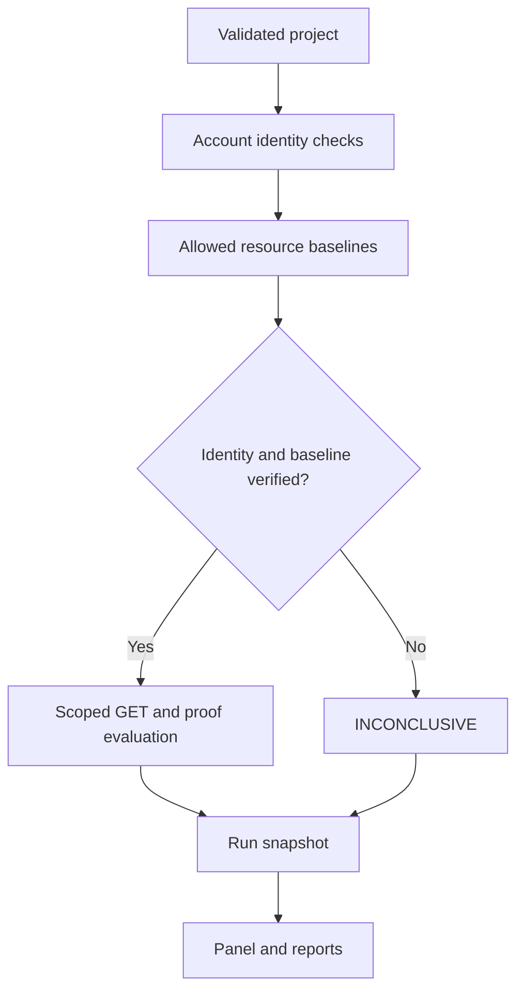

# Architecture

## Decision pipeline

Every run captures the validated project and current credentials in memory.
Requests are sequential and share a single start-rate limiter, including the
identity checks and baselines. There are no retries or opportunistic discoveries.

1. **Identity**: GET each account's precheck path using that account's Bearer
   token. Require a 2xx JSON response matching every configured assertion.
2. **Positive baseline**: GET each resource as its allowed baseline account.
   Require a verified identity and matching resource success proof without
   conflicting denial proof.
3. **Matrix**: evaluate every account/resource expectation. Skip the target
   request if that account's identity or that resource's baseline is unverified.
4. **Persist**: store sanitized progress and the final immutable snapshot.
5. **Present**: the panel and CLI use the same engine and report generators.

Proof assertions are conjunctions of RFC 6901 JSON Pointer scalar equalities.
`~1` escapes `/`, `~0` escapes `~`; array indexes use decimal positions. Boolean
`true` does not equal numeric `1`. JSON `null` is distinct from an absent field.
Object/array equality and nonfinite numbers are rejected.

## Demonstration policy

| Resource | Ayşe · org-a user | Can · org-a admin | Bora · org-b user | Baseline |
| --- | --- | --- | --- | --- |
| Ayşe invoice | allow | allow | deny | Ayşe |
| A-company admin report | deny | allow | deny | Can |
| Bora invoice | deny | deny | allow | Bora |

Roles and tenant IDs are descriptive metadata. **Permissions are explicit**;
the engine does not infer policies from role names. Customize the matrix to
your application's actual authorization model, including same-tenant ownership.

The vulnerable fixture omits tenant filtering on invoices. The admin report
remains restricted, demonstrating that different resources can enforce different
boundaries in the same run. The expired fixture uses fixed authorization but
rejects Bora's token before resource checks.

## Local API and persistence

The standard-library HTTP server binds to IPv4 loopback. The browser receives a
CSRF token from `/api/bootstrap` and submits JSON mutations with a custom header.
There is no CORS allowance. The coordinator permits only one active run and
captures credentials at run start. Worker requests are separate from UI requests.

SQLite has two tables: project definitions and run snapshots. Project edits
replace the current definition. Each run contains its own validated project
copy, identity checks, baselines, per-cell results, counts and timestamps.
Completed/cancelled/failed/interrupted runs cannot be updated through storage.
A restart marks unfinished running records `interrupted`. Deleting a project
preserves its historical runs.

API routes:

| Method | Route | Purpose |
| --- | --- | --- |
| GET | `/api/bootstrap` | Projects, recent run metadata, CSRF and token availability |
| POST | `/api/validate` | Normalize a project without saving |
| GET / POST | `/api/projects` | List / create project |
| PUT / DELETE | `/api/projects/{id}` | Update / remove current definition |
| POST | `/api/projects/{id}/runs` | Start a captured run |
| GET | `/api/runs` | Latest 200 run metadata records |
| GET | `/api/runs/{id}` | Sanitized run snapshot |
| POST | `/api/runs/{id}/cancel` | Request active-run cancellation |
| GET | `/api/runs/{id}/report.json` | Download JSON snapshot |
| GET | `/api/runs/{id}/report.html` | Download standalone HTML |

## Why this stack

Python's standard library supplies HTTP, verified TLS, JSON, SQLite, threading,
CLI arguments and tests. This keeps the release executable without downloading
backend dependencies. React, TypeScript, Vite and Lucide provide the panel; its
compiled assets are included. Node is needed only to change/rebuild that UI.

The engine accepts an injected transport and credentials for deterministic tests,
but production panel runs use the scoped HTTP transport. The real demo and
transport tests also cross actual HTTP boundaries rather than using only mocks.
